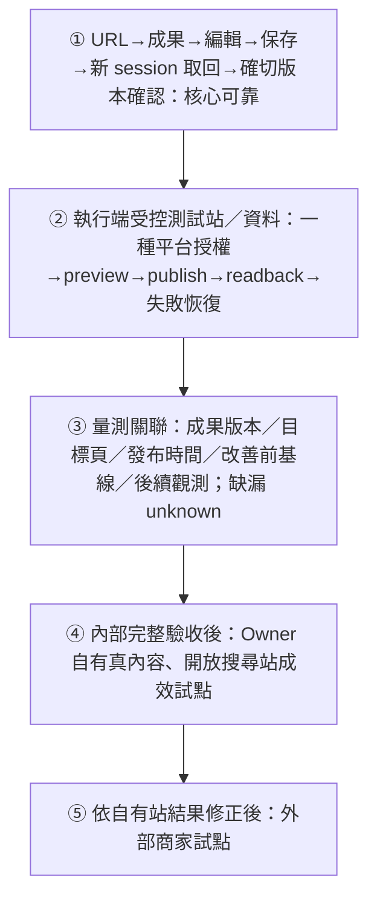

# Growth OS｜執行藍圖 v2.0

更新：2026-10-10（Owner 持續服務與低負擔互動報告增量對齊；沿用 v2.0，不另立藍圖）。**本文件是產品方向、M0–M6 與工程優先順序的唯一現行 source of truth。** 2026-10-02 已依 Owner 拍板取代 v1.13 的對話／計畫先行 onboarding；[舊藍圖完整歷史](Growth_OS_執行藍圖_v1.13_歷史_2026-10-02.md)保留，舊里程碑與「最小下一項」不再指派新工作。技術文件與 PROJECT_STATUS 必須依本文件同步，不各自定義產品路線。

## 1. 北極星流程與產品原則

**貼上產品／網站網址 → 系統理解網站與產品 → 自動完成必要分析 → 第一份可用成果 → 使用者確認／微調 → 授權發布 → 回來看懂實際效果。**

工程閉環名稱：**URL → First Useful Result → Review → Publish → Measure**。第一客群為電商／貿易商，首版聚焦產品頁自然搜尋的相關流量；轉換優化後置。

- 網址是主要入口。可由公開頁可靠取得的資訊自動填入，不重新問已知資料。
- 事實、推論與未知分開。先交付有來源的初步成果；只有答案會影響事實正確、商業優先順序或執行授權時，才在成果旁提出少量必要問題。可靠可得資訊不重問，確認後持續復用、變化才釐清；不引入必填六題、完整 Profile 或通用聊天通關。
- 沒有網址、無法讀取或內容不足時，保留輸入並提供補充公開資料／貼內容等恢復方式，明示降級；不能把 fallback 當主入口。
- 第一價值時刻是可查看、微調且帶來源的實際成果；完整產品價值是完成有依據、可落地的網站改善並觀測相關流量，不是設定完成、計畫或只有三段 AI 文案。
- 複雜工作由系統處理；一般使用者只見成果、必要確認、發布狀態與效果。來源、版本與稽核可展開，內部治理仍嚴格保留。
- 未服務此閉環的功能暫緩。既有驗收不重做、不刪除，不因新方向降低 Auth/RLS／tenant、approval、版本或 audit 要求。

## 2. 第一個可用成果定義

目前已實作的第一成果切片為：**一份針對輸入產品頁的可套用搜尋內容改善包**，包含建議產品頁 title、meta description 與一段產品描述，提供原文／建議對照、改善理由、來源引用、待確認事實，以及可複製／下載的成果。三欄文本只是可能交付物；產品必須走到有依據的改善實際落地與相關流量觀測，不能以產出三段 AI 文案宣告價值成立。

這是首個垂直切片的工程預設，不是每個任意網站都適用的承諾。首頁或分類頁先自動辨識並提供一個有依據的產品頁候選；無法可靠選定時只詢問要改善哪個產品。頁型不支援或事實不足時明示原因，不用通用文字假裝完成。

成果放行條件：

1. 來自該頁的可追溯來源快照（原始／最終 URL、擷取時間、內容版本與引用），產品名稱、特性與用途不捏造。
2. 實際提供可使用文本，不只建議清單、評分、分析報告或「待生成」占位。不得新增無來源的規格、價格、認證、比較、效果或保證。
3. 對使用者已知資訊不重問；關鍵歧義或必需資訊缺口可在成果旁處理。影響事實正確性的缺口未解決前，不放行相關內容發布。
4. 內容版本可微調，修改令舊核准失效；使用者可看懂要套用哪一頁、改哪些內容。
5. UI 明示「待確認／未發布」；沒有模型連線時如用固定規則或合成頁面，只能標示離線工程證據，不能宣稱真實自動理解已完成。
6. 目標使用者可辨識其用途並願意採用；測試 PASS 只證明程式條件，不代替可用性驗證。

## 3. MVP 最短閉環

### 使用者產品流程

此圖只描述使用者產品流程。保存、跨 session 恢復、權限與版本核對由系統支援；內部驗證順序不增加使用者操作。

| 步驟 | 系統工作 | 使用者必要動作／完成證據 |
|---|---|---|
| URL | 安全讀取公開頁，識別產品與支持的頁型，保存來源快照 | 貼網址；失敗能保留輸入與恢復 |
| First Useful Result | 自動抽取事實、處理必要分析、產出單頁改善包 | 查看可用文本；必要缺口才補資料 |
| Review | 原文／建議對照、來源／版本、允許微調與事實確認 | 核准確切版本；不操作計畫管理 |
| Publish | 驗證站點與單一試點平台權限，預覽差異、冪等提交與發布讀回 | 最小必要平台授權與發布確認；可核對目標頁／時間／版本 |
| Measure | 連結該成果、發布紀錄與授權數據，顯示基線、觀測窗與可信狀態 | 回訪直接看目前效果、資料缺口與下一步 |

第一版先完成一個產品頁、一種改善包、一種平台與一條可信量測路徑。先由執行端準備受控測試站／測試資料驗發布閉環，再進入 Owner 自有站成效試點，最後才是外部商家。已有執行端受控 WordPress 驗證資產，復用前核其適用範圍；不將其當成 Owner 原站平台，不預設 OAuth 或站點所有權；新帳密／費用／外部授權由父提出精確需求。Owner 自有站的站點、平台與改動範圍於試點階段確認；本次不授權改動任何 Owner 既有網站。

未連接發布時可複製／下載，必須標示「尚未發布」；這是可用成果降級出口，**不算完整 MVP 閉環**。人工發布須提供可核查的確切版本與目標頁證據；光是使用者聲明、匯出或內部 completed 不算系統核實發布。

量測以已授權 GSC 資料或可驗證匯出起步，連到目標頁及發布時間；基線需求在成果／發布設計時就定義，不等發布後才想量測。改善前基線須在發布前取得或明示未知；沒有歷史資料只能從發布時開始累積後續觀測，不能冒充改善前基線；沒有權限／資料顯示未知或等待累積，不填假數字。SEO 曝光／點擊、GEO 提及／引用與到站訪問分開，資料未取得就明示。前後變化不宣稱因果。

## 4. 現有成果的處置

| 分類 | 成果／能力 | 新定位 |
|---|---|---|
| 保留 | Auth、RLS、tenant isolation、owner/viewer、不可覆寫歷史、approval、audit、版本衝突與 CI/E2E | 所有新來源、成果、發布與量測沿用；不放寬安全，不重建 repo／框架 |
| 保留 | 公開頁 scanner 與安全測試、來源／推論契約、草稿 review、CSV／觀測契約 | 評估可復用部分，增量補 URL 產品理解與成果鏈；原型 PASS 不等於部署或新閉環驗收 |
| 降為內部能力 | Growth Plan／Work Card 契約、stateRevision、記憶體 session／事件歷史 | 系統執行與治理結構；只實作新閉環確實需要的最小保存／恢復，不要求使用者先建計畫 |
| 降為內部能力 | 固定問答／目標保存、Business Profile、管理工作台 | 必要缺口 fallback、內部調試與進階管理；不作 URL 主 onboarding 門檻 |
| 延後 | 通用計畫編輯器、完整對話產品、更多工作卡管理介面、獨立 M2 真保存擴張 | 不直接推進 URL 閉環則停止；已有離線 demo 保留為驗收資產 |
| 正式後續路線 | 每週 Growth Agent、批量頁面、多渠道（OpenAI Ads 僅未來渠道） | 依第 10 節分階段放行，不以三段文案為終點；未實作部分不標為可用 |
| 延後 | 轉換漏斗、GA4/CRM 歸因、其他業種、創作者流程、店家訂閱＋顧客支持、收費與付費資料工具 | 保留契約；有效資料與需求成立再排序，不加入本輪 |
| 已有切片，補閉環驗收 | URL 主入口、安全來源快照、產品事實／缺口辨識、第一份成果生成與品質檢查 | M1/M2，來源安全與第 2 節成果品質條件保留 |
| 增量補缺口 | 成果導向 review、單一平台授權／發布／恢復、可信效果回訪頁 | M3 已有隔離切片，M4/M5 仍缺實際關聯閉環；不以治理代替產品行為 |

## 5. 不一致審查與取代範圍

| 審查位置 | 舊內容／問題 | 本次取代 |
|---|---|---|
| v1.13 第 1／3 節與首頁文案 | 自然語言目標及六欄資料先行，第一成果在計畫之後 | 網址主入口、自動取得與必要缺口 fallback，先交付成果 |
| 舊 M1–M3 | 完整對話 → 計畫／工作卡 → 草稿，容易把設定完成當價值 | 來源理解 → 第一成果 → 成果 review；plan/work 是內部依賴 |
| 舊 M4–M6 | 發布被拆到遠期試點，內部執行可先當產品流程 | 發布與量測都進入第一 MVP 必做閉環 |
| PROJECT_STATUS／README | 過期 next step、v1.7 文案、舊驗收與目前狀態混列 | 現行 v2 路線與逐項客觀證據；舊快照另存 |
| PR #19 | 描述有效離線工程，但讀者可能以為 M2 demo 是產品主流程 | 保留程式與驗收；明示內部治理資產，URL 閉環尚未完成 |

舊 M1/M2 等驗收名稱是歷史工程標籤，保留檔名與證據；**不直接映射為下列新里程碑已完成**。新 M2 指第一可用成果，不是已完成的 plan/work-card demo。

## 6. UX 與治理要求

主要畫面圍繞「目前成果、需要我做什麼、是否發布、目前效果」。等待／失敗要有真實狀態及可恢復原因；不提供假進度、假產出或假成效。來源／版本／approval／audit 在詳情中可查，不要求使用者操作內部事件或六個模組。

公開內容是未受信任資料，不能指示系統擴權、讀 secrets 或執行工具。URL 不接受 credentials、內網／metadata／loopback；每次 redirect、DNS 與實際連線位址皆驗證，限制超時、大小與請求數。不讀登入頁或跨越存取限制。只有授權工作區才能長期保存、發布或取得一方數據。

修改、來源漂移、版本／tenant／session 改變令舊核准失效。發布採最小權限、確切版核准、冪等鍵、讀回與稽核；不確定提交結果先核對，不盲目重試。恢复／撤回須依試點平台能力定義並驗證，不預設可回滾。既有 API／RLS 是遠端 authority，memory-only 角色與 fingerprint 不是可信授權。

## 7. 執行邊界與現況

當前 W0 工作分支為 `feat/private-host-bootstrap`／[Draft PR #28](https://github.com/RC918/Growth-OS/pull/28)，起點 `d62805a15cdafb1976b420dad1cec42e4d150bf2`。PR19 是歷史資產，不重播初始化，也不一次合併全部候選。最新能力以 [PROJECT_STATUS](../PROJECT_STATUS.md) 的已實作／已測試／已部署／目前可用狀態為準。父已轉達原 Reviewer 對 R7 一次保存、確切 v1 確認、關窗後新登入唯讀取回 APPROVE；server/client writer 已關閉。這是固定介紹切片，不證明通用業務答案依賴或任意網站服務完成。

Owner 原網站為自有伺服器，正式後台／部署路徑待 Owner 提供。只阻塞原站發布；文件與隔離普通工程仍可進行。歷史 R7 英文來源與目前公開中文頁有內容差異，原確認不得移用為現頁發布批准。未核實原站發布或商家流量成果。

日常 Auth regression 用既有隔離 synthetic accounts／fixtures／test-only sessions，不依賴 Owner email／2FA。真人 checkpoint 只限 Auth 本身改動、RC／重大 milestone 中的人員必要步驟、強制 challenge 或不可代理的法律／授權／事實確認，並須說明必要性；只阻擋直接相依步驟，不全域停工。既有 hosted 工具限制仍須遵守，不能以 synthetic PASS 繞過或自行 restore。

本次為 Owner 授權的文件對齊；保留所有成果，不改 runtime／SQL／frozen／Auth／remote／restore，不呼叫模型／live URL、不新增費用或正式發布、不修改 Owner 既有網站。既有預算與帳號不是新支出或外部授權。後續普通工程依下列順序推進；真正依賴新費用、帳密、外部授權或既有網站修改時，由父提出具体範圍。

## 8. 更新後的工程路線圖與驗收

### 內部驗證順序（Owner 2026-10-04 核定）

這是執行端的開發／驗證順序，不是額外 onboarding。外部商家不是目前開發前提，受控測試站也不等於 Owner 既有站。單一真人 checkpoint 不阻止不相依的已授權工程準備，但不能跳過關聯的放行條件。

| 順序／沿用里程碑 | 最小交付與放行條件 |
|---|---|
| ① M0–M3 核心可靠 | 沿用帳號／權限／tenant／來源／版本／review／audit；同一路徑完成 URL、可用成果、編輯、保存、新 session 精確取回、確切版確認。修改或來源漂移令舊確認失效；取消／未知結果安全恢復，owner/viewer／跨 tenant 邊界成立。既有通過部分不重建，實作與隔離／線上證據分列。 |
| ② M4 受控發布 | 執行端準備受控站與測試資料，完成一種平台的最小授權、差異 preview、exact version／page 發布、內容與時間讀回，以及拒絕、失敗／不確定結果的核對恢復。匯出與假發布 receipt 不算通過；恢復能力按該平台實際驗證。 |
| ③ M5 關聯量測 | 將成果版本、目標頁、可信發布時間、改善前基線及後續觀測串起；來源／搜尋或訪問口徑／期間／覆蓋可核查。缺資料 unknown，零與缺漏分開；SEO／GEO／到站訪問不混算，前後觀測不宣稱因果。 |
| ④ M6 自有站試點 | ①②③內部完整驗收後，選 Owner 自有、有真內容且開放搜尋的站；到此階段再確認站點／平台／改動範圍與必要授權，以五類驗收記錄成效及使用負擔。本次未授權改既有網站。 |
| ⑤ M6 外部商家試點 | 依自有站結果修正，再驗外部商家的可遷移性、使用負擔與流量觀測；不能提前作工程前置條件。 |

### 五類驗收（不可互相代替）

| 類別 | 必須保留的證據與界線 |
|---|---|
| 功能可用 | URL 到成果、編輯／保存／取回／確切版本確認可完成，錯誤可恢復；區分 synthetic 與線上證據。 |
| 發布正確 | 核准 exact version、正確目標頁、實際內容／時間讀回與失敗恢復；preview／匯出不是發布。 |
| 數據可信 | 來源、期間、時區、定義與口徑、覆蓋／缺漏可查；提供者聲明不冒充核實，unknown 不填零。 |
| 成效觀測 | 分別觀察收錄、相關曝光、點擊、到站訪問與前後期間；資料不足就列未知／限制，前後變化非因果，測試通過不等於流量價值成立。 |
| 使用負擔 | 記錄操作次數、必要判斷次數、求助次數及卡住位置；內部測試操作不當作目標使用者可用性結論。 |

2026-10-10 工作包沿下列 W0–W5 增量接續，仍服務上述 M0–M6 與單一路線。當前只完成 W0 並提出 W1 具體範圍，交原 Reviewer；不由 Primary 自選開工。①既有接受成果直接引用，W1 補必要答案與依賴缺口；W2 接②③，W3–W5 逐步擴持續服務。原站發布等待不構成 W1 全域阻塞。

| 工作包 | 完整成果與邊界 |
|---|---|
| W0 文件對齊 | 同一藍圖、設計、status；不計產品功能完成 |
| W1 答案影響成果 | 一項產品事實→正確工作區保存→相依草稿新版→舊核准失效→隔離 fresh-session 讀回→UI 說明用途；先驗權限／版本／依賴，目標環境另依有效授權 |
| W2 單頁發布／可信觀測 | 復用已驗 publisher／恢復／measurement；補確切事實與內容版、目標頁、可信時間、基線與後續觀測關聯，缺漏 unknown |
| W3 一輪持續處理 | 一頁一種確定性內容變化→唯一任務→必要一題→候選→批准動作→讀回；實際觸發、持久接續與恢復各有回條 |
| W4 每週 Growth Agent | W3 通過後整合監測、業務資料、排序、有限執行及摘要；實測觸發與異常恢復，記人工步驟 |
| W5 批量／多渠道 | 單頁品質及持續服務成立後逐步擴量，不同時鋪全部渠道 |

## 9. 文件與歷史

- 本文件：唯一現行產品路線。
- [系統設計](Commerce_Growth_系統設計_v0.1.md)：現行技術對齊，不另設產品里程碑。
- [PROJECT_STATUS](../PROJECT_STATUS.md)：已驗證／進行中／待完成的快照。
- [v1.13 歷史](Growth_OS_執行藍圖_v1.13_歷史_2026-10-02.md)：完整原文保存，不作現行工作指令。
- 既有驗收、程式與測試保留；文件對齊不宣稱新閉環功能已完成。

## 10. 持續服務與低負擔互動（2026-10-10 增量）

首次服務維持 URL→有來源成果→必要確認／微調→有效授權發布→可信觀測。持續服務將系統觀測與商家校正接回工作：新觀測＋有效業務資料→辨別變化與重要性→必要釐清→更新草稿／任務→按授權處理→核實發布及後續結果。兩者不增加首次 onboarding 必填步驟。

| 階段 | 商家可見成果 | 放行條件 |
|---|---|---|
| A 單頁可靠服務 | 答案保存後改變相關草稿；發布／觀測可追溯 | 真來源、版本、權限、恢復及指定環境流程通過 |
| B 每週持續工作 | 處理變化、必要時問一題、交付工作與下一步 | 真觸發、持久任務、用量上限、失敗恢復、通知與一輪接續證據 |
| C 批量頁面 | 按產品／市場批量準備、核稿、發布 | 單頁品質成立；拒絕重複／無來源／過時內容；預覽、配額、停止及平台可行恢復 |
| D 多渠道 | 同一商家事實支持各渠道成果 | 各自權限、格式、送出／發布回條、撤回能力與口徑驗收 |

### 提問、保存與影響範圍

每題必須有觸發原因、受影響決策、現有證據、不回答的處理方式。一次以一個必要決策為目標；預填理解與理由，可選擇／修正／略過，無須長篇輸入。產品排序可給明示暫定預設，沉默不算確認。規格未知可先產不含該宣稱的安全版本；只阻擋相依內容。停售或頁面消失先釐清，不自動刪其他頁。

有效答案不重問、不固定週期重問五題；通知去重、合併待答問題並提供摘要頻率。回答後就近說明用途，例如「已將 B 設為優先，下一份內容會聚焦它的採購需求」。商家確認不是外部驗證；事實、偏好與發布授權分開。資料依工作區／產品／市場／渠道、版本、來源、有效性與依賴復用；細節依系統設計第 5 節。

答案改變使相依草稿產生新版、已核准未發布的舊核准失效；保留舊版、已發布／完成觀測歷史。不相依工作繼續。已發布頁先呈差異，依當下有效授權修正，無授權只備候選。發布前重核事實、來源與內容版；依賴未知只暫停相關發布。

### 觀測接處理與服務回報

先一頁、既有授權來源、合理刷新頻率。比較前核頁面、期間、時區、來源、延遲、覆蓋、篩選、基數；未連接、故障、未累積與真零分開。資料充足且依預定比較方式才標變化；短期少量波動不直接觸發重寫。先調查可見來源漂移、URL／內容／可抓取性，再列未證實假設，結合商家產品／客群與成本決定處理。排序用可解釋高／中／低，考量事實風險、商業相關性、證據、影響、可行性、成本及既有工作／冷卻期，不偽造精準 ROI。

允許「本週不改，繼續觀察」，附原因與下一檢查條件。每期摘要交代變化、完成動作、發布核實、觀察、未知、下一步理由及是否需商家操作；無事可顯示「本週不需你操作」。首頁呈現已完成／需決定／發布狀態／目前效果與下一步。保存、確認、發布成功分開；SQL、runner、SHA、gate 等內部細節收合，不要求商家搬檔或貼 SHA。手機、桌面、鍵盤皆能提問／略過／保存／核稿／看狀態，失敗保留輸入。

發布正確與流量效果分別驗收。季節、需求、競爭、搜尋平台、策略／網站變動及資料故障皆可能影響觀測；不承諾排名／流量精準預測。SEO／GEO／訪問／合格詢問／成交分開，沒有有效訂單／CRM 鏈不顯示歸因收入。先記等待時間、操作／決策／求助數、重問與錯誤、處理時效／成本、觸發恢復／人工介入、採納／留存及真付費基線，再設門檻；頁數、測試數或報告不等於增長與願付價格。

### 授權、自動化與成本

確認事實、選產品、核准文案、授權發布各自記錄；一次回答不授權全站修改，沉默不是批准。沿用 exact-version authority。未來範圍授權須具體限定頁集合、欄位、禁止宣稱、數量／成本、期限與撤銷，服務端實測拒絕失效權限，不能只隱藏按鈕。內部觀測／分辨／草稿／報告在有效配額內自動進行；對外送出、新共享、採購、廣告等沿既有授權。

頻率、抓取頁數、模型、工具及每輪工作量均有上限，快取並只處理變動；超限停止相依工作，餘額不是新批准。產品自主服務與工程 controller 分別驗收：真觸發時間、持久任務 ID、接收／執行／完成回條、Reviewer 結果及恢復證據不足時，不宣稱零人工或長時間無人值守；skill／status 文字不是後台執行器。

本增量依 Owner 2026-10-10 報告全文；所引東元文章未獨立核實，僅採用設計原則，不作技術／財務／訂閱成效證據。報告不授權新費用、外部權限、任意合併、production 部署或 Owner 原站修改。每包只修 P0/P1 與必要 P2，P3/P4 記債；完成即交原 Reviewer。連續兩包僅文件／搬證據／重驗時，核必要阻塞並返回商家可見成果，不另造治理框架。
