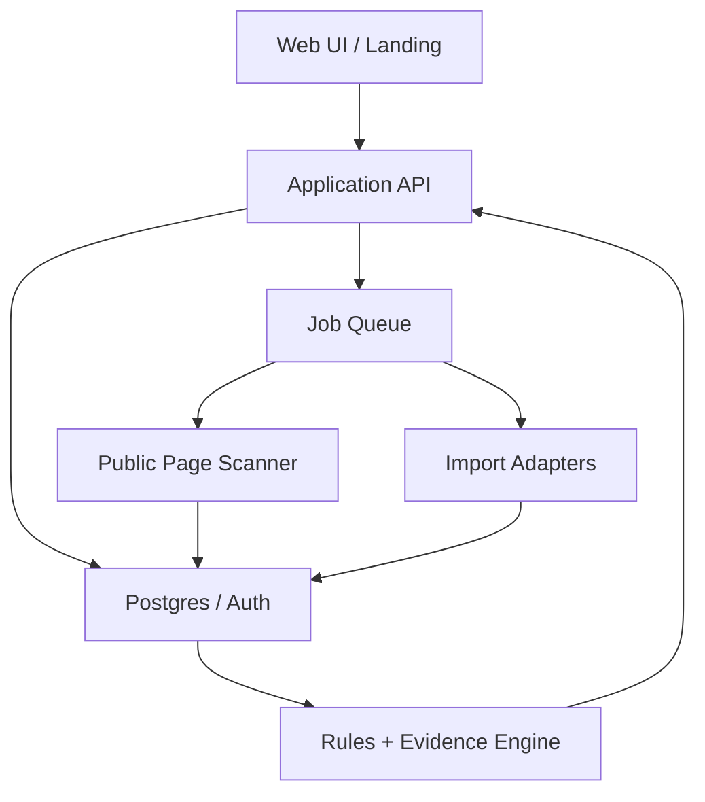

# Commerce Growth｜系統設計 v0.1

2026-09-27　工作標題：Growth OS by Good Morning Digital。正式產品品牌與網域待定。此文件是開工設計；目前沒有已連接客戶網站、真實漏斗或上線成效。

> 2026-09-28 定位校正：本版保留 Visitor-to-Customer Leak Map 的技術契約，但它是流量進站後的第二層診斷。產品主流程與下一階段順序以《Growth_OS_定位修正_2026-09-28.md》為準。

## 1. 產品決策

服務對象：有自營網站的中小電商與貿易商。第一個模組是 **Visitor-to-Customer Leak Map**，從創辦人「FB、TG、LINE／簡訊導流後訪客不註冊」的真實問題出發。主要成果依商業模式分別為淨訂單或合格詢盤；註冊是中途事件。既有 SEO/GEO、內容、AI 引用與 Ahrefs 情報屬後續擴張，資料介面先預留，不讓第一版被它們阻塞。

第一版兩種模式：

| 模式 | 輸入 | 可主張的輸出 | 禁止的主張 |
|---|---|---|---|
| Public Audit | URL、商業模式、目標市場 | 可見頁面摩擦、具證據的網址／元素、待查問題 | 真實流失率、廣告 ROI、AI 引用或訂單歸因 |
| Connected Diagnosis | 已授權的 GA4、廣告、商店/CRM；初期允許 CSV | 各來源及頁面漏斗、資料缺口、建議與事後觀測 | 單靠前後變化聲稱因果、跨平台數字無定義相加 |

Public Audit 可匿名試用且受速率限制；儲存報告、接入資料與執行建議需要工作區。對任何第三方網址均只掃描公開頁，禁止探測內網與敏感路徑。新網站本身從上線起建立 GA4/GSC，不能展示尚不存在的成果。

## 2. 架構

部署候選：Next.js/TypeScript Web 與 API 放 Vercel；PostgreSQL/Auth 使用 Supabase；DNS/WAF 用 Cloudflare；排程與工作者使用受管佇列或獨立執行環境，由負載測試後決定。先避免把耗時外部掃描放在同步 HTTP 請求。遵守既有專案偏好，不採 Render。這是候選拓撲，沒有聲稱已取得或配置帳號。

**執行路徑**：UI 提交 URL → API 正規化與速率限制 → 工作排隊 → 安全掃描 → 存原始證據摘要／抓取時間 → 規則產生 finding → UI 顯示信心與限制 → 使用者選擇建立工作區 → 匯入授權資料 → 重新診斷漏斗 → 建議實驗 → 人核准 → 記錄動作與結果。

## 3. 安全掃描與資料權限

- URL 僅接受 HTTPS 公開網域；解析每次跳轉並拒絕 loopback、private、link-local、metadata IP 及非 HTTP(S)；限制跳轉、bytes、回應時間、每網域請求數。DNS 解析與實際連線地址一致驗證，避免 DNS rebinding。標明 user agent，遵守 robots 與站點限制。
- HTML 抽取只讀公開頁；不登入、不提交表單、不執行任意站點 JS 或下載未知檔；如需瀏覽器截圖，放隔離工作者並限制網路權限與資源。
- 免費掃描結果可短期快取，但第三方網站的公開掃描不等於該站所有權。只有驗證網域的工作區才能連接一方數據或存長期報告。
- OAuth token 只存加密服務端，最小 scope，可撤銷；初期 CSV 由已驗證工作區管理者上傳，顯示來源與欄位映射預覽。不要收廣告帳號密碼。
- 日誌不寫表單內容、客戶姓名、電話、電郵或 token；事件用內部不可逆 ID。提出預設保存期限：匿名掃描 30 天、匯入批次 90 天、聚合與審計紀錄 13 個月，正式公開前依產品實際需求與適用政策審核。
- 工作區隔離以 `organization_id`、Postgres RLS 與服務層檢查雙重執行；跨租戶 ID 猜測應回 404。所有資料匯出和刪除要有審計事件。

## 4. 資料口徑與契約

三個資料層級：`observed`（一方來源真實事件）、`associated`（同來源、頁面與時間窗的關聯）、`estimated`（模型估計）。每個數字保留 `source`, `collected_at`, `window_start/end`, `definition_version`, `coverage`, `limitations`。

| 指標 | 口徑 | 主要來源 |
|---|---|---|
| Ad click | 廣告平台所報的點擊，非網站工作階段 | 廣告平台或 CSV |
| Landing session | GA4 中帶來源的登陸會話；可能受同意/瀏覽器影響 | GA4 |
| Engaged action | CTA、商品瀏覽或表單開始；事件去重 | GA4 / 網站事件 |
| Lead | 提交詢問；另由 CRM 判定是否合格 | GA4 + CRM |
| Net order | 唯一交易 ID 的付款減退款，若可取得再計毛利 | 商店/訂單系統 |
| Signup | 建立帳戶；不得當作電商與貿易的最終成果 | GA4 / Auth |

以 GA4 官方建議事件作基礎：`view_item`, `add_to_cart`, `begin_checkout`, `purchase`, `refund`, `generate_lead`, `sign_up`；自訂 `landing_cta_click`, `quote_request_start`, `form_error`。UTM 命名表：`utm_source=facebook|telegram|line|sms`, `utm_medium=paid_social|paid_message|sms`, `utm_campaign`, `utm_content`。渠道廣告點擊與 GA4 登陸工作階段不是相同計數，不直接相減稱為「流失人數」。

資料處理：先保存匯入批次及校驗結果，再按日期、來源、活動、裝置、落地頁聚合；同一來源同一筆交易去重。缺失欄位保留 `null` 而非 0；樣本量過低時只展示原值，預設不產出百分比勝出結論。`net_revenue` 必須有同幣別與退款資訊，否則保持未知。

## 5. 模組與責任

| 模組 | MVP 交付 | 下一階段 |
|---|---|---|
| Intake & Scan | URL 驗證、非同步公開掃描、證據快照、規則 findings | JS 截圖與多頁巡檢 |
| Workspace & Auth | 單站工作區、角色 owner/editor/viewer、網域驗證 | 多站、Agency |
| Import | GA4/廣告/商店 CSV 欄位映射與冪等批次 | 官方 OAuth/API、排程同步 |
| Funnel | 按來源/落地頁/裝置的階段計數、缺口與定義 | cohort、跨設備、增量試驗 |
| Recommendation | 規則分數：影響、信心、工作量；來源與理由 | AI 補充說明、建議排序 |
| Action & Proof | 預覽/核准/記錄實驗，前後觀測與限制 | 自動發布、嚴格對照實驗 |
| SEO/GEO Adapter | 公開技術檢查、GSC 匯入介面預留 | Ahrefs、AI citation、多市場 |

LLM 第一版只協助把已驗證 finding 改寫成可讀建議；不得生成不存在的訪客、訂單或競品數據。核心漏斗、金額與證據鏈由程式計算。

## 6. 主要畫面

1. **Landing**：網址欄、商業模式選擇、公開掃描說明；不用信用卡。
2. **Public Report**：3 個具證據的摩擦點、截取來源、信心、未知資料；CTA 為「連接數據，找出實際流失步驟」。
3. **Connect**：驗證網域、選 GA4/CSV、欄位預覽、同意與撤銷。
4. **Funnel**：來源 × 落地頁 × 裝置篩選；各階段分母與資料完整度；電商與貿易指標不同。
5. **Action**：一項建議、證據、預期風險、核准、實驗版本與停止條件。
6. **Proof**：發布/變更時間、觀測窗、對照（若有）、leads/淨訂單、未知與推論。

全產品導航可維持 Home、Opportunities、Growth、Visibility、Business；初期把上述六步整合在 Home/Opportunities/Growth。未接數據時不能出現模擬報表當真實數值。

## 7. API 與資料庫交付

- `Commerce_Growth_openapi_v0.1.yaml`：公開掃描、工作區、匯入、漏斗、建議與行動的 HTTP 契約。
- `Commerce_Growth_schema_v0.1.sql`：Postgres 起始 schema、索引與租戶隔離方向。
- API 對外回傳 `data_quality`，包含資料來源、最後同步時間與缺口。掃描/匯入採非同步狀態機 `queued → running → completed|failed`。反覆提交相同匯入 batch key 不得重複計入。

## 8. 開發順序與可驗收門檻

| Sprint | 必須做出的東西 | 驗收方式 |
|---|---|---|
| 1 | Repo、Web 首頁、公開掃描 API/worker、findings 規則 | 用三個授權測試網址驗證安全限制、報告證據與未能判斷狀態 |
| 2 | Auth/工作區、網域驗證、CSV 匯入、事件字典 | 重複匯入不重算；跨租戶不可讀；缺欄報錯可理解 |
| 3 | 漏斗頁、貿易/電商口徑、建議與 Action Log | 模擬資料與手算一致；低樣本、退款、未知口徑正確 |
| 4 | Staging 端到端、真實站量測、自用試驗 | Deployment/API/DB/E2E 四項雲端證據；真實數據與模擬資料嚴格分離 |

任何對外發布或花費單筆預算的動作由 Owner 核准；設計與本地/Staging 可先行。90 天現金上限 NT$100,000，Sprint 1 前的第一關最多 NT$15,000；若外包工程，人力預算另列。

## 9. 待實作風險與明確非目標

初期不宣稱真正跨平台完整歸因、AI 推薦保證、Ahrefs 等價資料或自主改動客戶網站。廣告平台報表與 GA4 可能因統計口徑和同意狀態不同；只展示各自來源與可比性。公開掃描不得成為任意 URL 代理或內部網路探測。大規模 pSEO 發布、購買 Ahrefs API、品牌/商標註冊、支付系統與全自動部署留到相應驗收後。

## 10. 官方參考

- GA4 recommended events：https://support.google.com/analytics/answer/9267735
- GA4 traffic source dimensions：https://support.google.com/analytics/answer/15612152
- Google consent mode：https://developers.google.com/tag-platform/security/concepts/consent-mode
- Google Search Analytics API：https://developers.google.com/webmaster-tools/v1/searchanalytics/query
