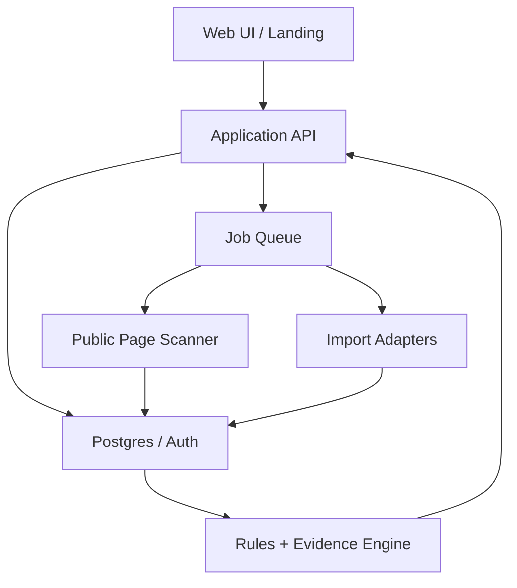

# Commerce Growth｜系統設計 v0.1

2026-09-27　工作標題：Growth OS by Good Morning Digital。正式產品品牌與網域待定。此文件是開工設計；目前沒有已連接客戶網站、真實漏斗或上線成效。

> 2026-09-30 更新：產品方向與里程碑以 [執行藍圖 v1.7](AI_Company_Growth_OS_執行藍圖_v1.md) 為主要依據。本文件整合產品需求與技術改造；保留 Visitor-to-Customer Leak Map 作後續轉換子模組。下列設計不是已完成宣告；實際資料結構以 `supabase/migrations` 為準。

## 1. 產品決策

優先服務電商與貿易商，核心目標為增加相關流量與點閱；保留產品／作品、受眾及渠道等可擴展欄位，創作者專屬流程未來另驗證。第一版先完成網站自然搜尋的對話與內容工作流程。轉換優化、GA4/訂單歸因與 Ahrefs 為後續能力。既有 **Visitor-to-Customer Leak Map** 保留為轉換子模組，創辦人的訪客未註冊案例不再決定整體入口。

後續轉換子模組保留兩種設計模式（不代表已連接真實來源）：

| 模式 | 輸入 | 可主張的輸出 | 禁止的主張 |
|---|---|---|---|
| Public Audit | URL、商業模式、目標市場 | 可見頁面摩擦、具證據的網址／元素、待查問題 | 真實流失率、廣告 ROI、AI 引用或訂單歸因 |
| Connected Diagnosis | 已授權的 GA4、廣告、商店/CRM；初期允許 CSV | 各來源及頁面漏斗、資料缺口、建議與事後觀測 | 單靠前後變化聲稱因果、跨平台數字無定義相加 |

Public Audit 可匿名試用且受速率限制；儲存報告、接入資料與執行建議需要工作區。對任何第三方網址均只掃描公開頁，禁止探測內網與敏感路徑。新網站本身從上線起建立 GA4/GSC，不能展示尚不存在的成果。

## 2. 架構

實際現況：`apps/web` 靜態 HTML／ES modules 放 Vercel，使用 Supabase Auth/Data API。改造先沿用這些模組，不預設重寫 Next.js。上圖為早期掃描子模組拓撲。新增主流程需要伺服器自然語言協調、目標／計畫／對話保存及執行事件；均待開發。早期部署候選：Next.js/TypeScript Web 與 API 放 Vercel；PostgreSQL/Auth 使用 Supabase；DNS/WAF 用 Cloudflare；排程與工作者使用受管佇列或獨立執行環境，由負載測試後決定。先避免把耗時外部掃描放在同步 HTTP 請求。遵守既有專案偏好，不採 Render。這是候選拓撲，沒有聲稱已取得或配置帳號。

**新主流程設計**：自然語言目標 → 結構資料驗證與逐步追問 → 使用者確認 → 保存計畫與工作 → 草稿版本及審核 → 內部執行事件 → 發布證據與觀測。每項資料有組織範圍；模型只能提議允許的操作，不能代替 owner 核准。

**後續掃描子模組路徑**：UI 提交 URL → API 正規化與速率限制 → 工作排隊 → 安全掃描 → 存原始證據摘要／抓取時間 → 規則產生 finding → UI 顯示信心與限制 → 使用者選擇建立工作區 → 匯入授權資料 → 重新診斷漏斗 → 建議實驗 → 人核准 → 記錄動作與結果。

## 3. 安全掃描與資料權限

- URL 僅接受 HTTPS 公開網域；解析每次跳轉並拒絕 loopback、private、link-local、metadata IP 及非 HTTP(S)；限制跳轉、bytes、回應時間、每網域請求數。DNS 解析與實際連線地址一致驗證，避免 DNS rebinding。標明 user agent，遵守 robots 與站點限制。
- HTML 抽取只讀公開頁；不登入、不提交表單、不執行任意站點 JS 或下載未知檔；如需瀏覽器截圖，放隔離工作者並限制網路權限與資源。
- 免費掃描結果可短期快取，但第三方網站的公開掃描不等於該站所有權。只有驗證網域的工作區才能連接一方數據或存長期報告。
- OAuth token 只存加密服務端，最小 scope，可撤銷；初期 CSV 由已驗證工作區管理者上傳，顯示來源與欄位映射預覽。不要收廣告帳號密碼。
- 日誌不寫表單內容、客戶姓名、電話、電郵或 token；事件用內部不可逆 ID。提出預設保存期限：匿名掃描 30 天、匯入批次 90 天、聚合與審計紀錄 13 個月，正式公開前依產品實際需求與適用政策審核。
- 工作區隔離以 `organization_id`、Postgres RLS 與服務層檢查雙重執行；跨租戶 ID 猜測應回 404。所有資料匯出和刪除要有審計事件。

## 4. 資料口徑與契約

三個資料層級：`observed`（一方來源真實事件）、`associated`（同來源、頁面與時間窗的關聯）、`estimated`（模型估計）。每個數字保留 `source`, `collected_at`, `window_start/end`, `definition_version`, `coverage`, `limitations`。

| 指標 | 口徑 | 主要來源 |
|---|---|---|
| Ad click | 廣告平台所報的點擊，非網站工作階段 | 廣告平台或 CSV |
| Landing session | GA4 中帶來源的登陸會話；可能受同意/瀏覽器影響 | GA4 |
| Engaged action | CTA、商品瀏覽或表單開始；事件去重 | GA4 / 網站事件 |
| Lead | 提交詢問；另由 CRM 判定是否合格 | GA4 + CRM |
| Net order | 唯一交易 ID 的付款減退款，若可取得再計毛利 | 商店/訂單系統 |
| Signup | 建立帳戶；不得當作電商與貿易的最終成果 | GA4 / Auth |

以 GA4 官方建議事件作基礎：`view_item`, `add_to_cart`, `begin_checkout`, `purchase`, `refund`, `generate_lead`, `sign_up`；自訂 `landing_cta_click`, `quote_request_start`, `form_error`。UTM 命名表：`utm_source=facebook|telegram|line|sms`, `utm_medium=paid_social|paid_message|sms`, `utm_campaign`, `utm_content`。渠道廣告點擊與 GA4 登陸工作階段不是相同計數，不直接相減稱為「流失人數」。

資料處理：先保存匯入批次及校驗結果，再按日期、來源、活動、裝置、落地頁聚合；同一來源同一筆交易去重。缺失欄位保留 `null` 而非 0；樣本量過低時只展示原值，預設不產出百分比勝出結論。`net_revenue` 必須有同幣別與退款資訊，否則保持未知。

## 5. 主流程模組與責任

| 模組 | 可沿用基礎 | 新需求及狀態 |
|---|---|---|
| Workspace/Auth | owner/viewer、組織隔離、Magic Link | 保留；待開發逾時恢復；目前恰好一個組織，不宣稱多工作區切換或 editor 已完成 |
| Goal/Conversation | 企業資料及機會表單 | 待開發目標、訊息保存、必要資料追問、推論確認；登入後可恢復 |
| Plan/Work | 機會、來源與審核 | 待開發計畫版本、工作卡與依賴；連結既有資料 |
| Draft/Review | 人工內容版本、owner 審核 | 待開發真實模型生成與來源約束；新版必須重新核准 |
| Execution | 內部行動規劃 | 待開發持久狀態、事件、冪等重試；對外發布第一版由人工處理 |
| Search Observation | 驗證、比較、不可覆寫保存及讀回 | 待開發工作連結、分頁及計算版本；來源核實另驗收 |
| Conversion/Scan | 公開掃描及離線診斷原型 | 未來規劃，保留本文件第 3–4 節的安全與量測契約 |

新資料設計需形成目標 → 計畫 → 工作 → 機會 → 草稿版本 → 行動 → 發布證據 → 觀測版本。實際表名與 API 待設計，以增量 migration 保留既有成果。每筆組織資料受 RLS 與 API 檢查；模型協調服務驗證使用者與結構輸入，使用允許操作清單，不記錄 token。流量指標由程式計算，模型不能編造訪客、點擊、訂單或成長。

## 6. 主要畫面與產品驗收

首頁：「想為你的作品或產品帶來更多流量嗎？」、「告訴我你正在做什麼，我們一起開始。」入口為自然語言輸入。工作區依「對話／工作／成長」組織，桌面可並列對話與目前工作，手機切換視圖；不全面替換既有管理頁。

| 流程 | 需求與驗收 |
|---|---|
| 目標與收集資料 | 每次追問一至兩項缺少資訊；無網站也可保存目標；推論可修正；必要時才要求網站或資料授權 |
| 計畫與工作卡 | 可修改計畫，顯示目的、證據、所需資料、下一步、版本與狀態；重整／重新登入可恢復 |
| 草稿確認 | 原版不可覆寫；審核連到明確版本；viewer 唯讀；修改草稿後不能套用舊核准 |
| 執行進度 | 由保存事件更新，等待、失敗與重試可辨；401 後重新登入可恢復；重複提交不得重複保存 |
| 發布與成長 | 草稿與內部計畫不能顯示已發布；人工聲明和核實證據分開；無資料顯示未知；合成與未核實匯入明示；不可比較的期間不產出誤導成長 |
| 回歸與可用性 | owner/viewer 及跨租戶直接 API 驗收；既有版本、審核、觀測仍可使用；桌面／手機、鍵盤可完成流程 |

此節為待實作需求；第一版沒有自動對外發布或已授權真實流量連接。真實成長里程碑須核對來源、日期、時區、指標與完整性；不能只憑合成 transport 或 SQL 測試宣告通過。

## 7. API 與資料庫交付

- `Commerce_Growth_openapi_v0.1.yaml`：公開掃描、工作區、匯入、漏斗、建議與行動的 HTTP 契約。
- `Commerce_Growth_schema_v0.1.sql`：Postgres 起始 schema、索引與租戶隔離方向。
- API 對外回傳 `data_quality`，包含資料來源、最後同步時間與缺口。掃描/匯入採非同步狀態機 `queued → running → completed|failed`。反覆提交相同匯入 batch key 不得重複計入。

## 8. 開發路線圖與本次變更

M1 固定問題引導、目標／問答保存及不可覆寫修正已完成本機切片，並經授權部署至獨立 Preview／測試 Supabase。修正後 CI 的桌面／手機合成流程與遠端 SQL 回滾驗收通過；新版精確 callback 已批准保存，真實 owner 保存／修正／讀回及 viewer 唯讀介面通過；新 RPC 真實拒絕、API 401 恢復及 PT409 先後版本衝突已通過；DB 交易重疊仍未驗收。上表的完整自然語言能力仍待開發。實際結果見 [M1 驗收紀錄](Goal_Intake_M1_驗收_2026-09-30.md)，不得將本機完成寫成整個 M1 放行。

路線圖統一使用 [執行藍圖第 8 節 M0–M6](AI_Company_Growth_OS_執行藍圖_v1.md#8-更新後的工程路線圖與驗收)，不另設互相衝突的 Sprint 排程。

2026-09-30 變更紀錄：原 Sprint 1 的掃描入口改為保留子工具；Sprint 2 的權限與隔離沿用，新增目標／對話保存；原 Sprint 3 的漏斗頁與轉換口徑延後，優先計畫、工作卡及草稿確認；原 Sprint 4 拆為操作流程與可信真實數據兩個驗收，避免測試資料被當成成長證據。

先完成 M1 保存與權限契約，再做 M2 計畫／工作卡、M3 真實產稿及內部執行，M4 觀測連結及資料可信度；M5 真實試點與 M6 外部驗證須另有證據。模型與執行環境待選，不因文件更新購買服務。

方向更新輪只修改文件；後續已依使用者指示完成 M1 切片並恢復測試部署及驗收。範圍限 Growth OS 獨立測試環境；不修改 morningai、owner-console、正式網域或付費設定。既有預算條件保留。

## 9. 待實作風險與明確非目標

初期不宣稱真正跨平台完整歸因、AI 推薦保證、Ahrefs 等價資料或自主改動客戶網站。廣告平台報表與 GA4 可能因統計口徑和同意狀態不同；只展示各自來源與可比性。公開掃描不得成為任意 URL 代理或內部網路探測。大規模 pSEO 發布、購買 Ahrefs API、品牌/商標註冊、支付系統與全自動部署留到相應驗收後。

## 10. 官方參考

- GA4 recommended events：https://support.google.com/analytics/answer/9267735
- GA4 traffic source dimensions：https://support.google.com/analytics/answer/15612152
- Google consent mode：https://developers.google.com/tag-platform/security/concepts/consent-mode
- Google Search Analytics API：https://developers.google.com/webmaster-tools/v1/searchanalytics/query

2026-09-30 目前結果：新問答 RPC 真實 viewer／跨租戶 403 與 API 層真實 401 後恢復通過。先前競爭保存的 40001／504 已記錄；使用者批准後，PT409 精確修正已套用隔離測試資料庫，先後 API 保存 200／223ms、舊版本拒絕 409／PT409／268ms 通過，原歷史與授權保留。未新增 Vercel 部署；DB 交易重疊、自然 JWT 到期瀏覽器恢復及本機提示修正部署後驗收仍未完成，M1 不全面放行。完整證據與回復方式見 [M1 驗收紀錄](Goal_Intake_M1_驗收_2026-09-30.md)。

## M1 接續檢查點：Preview 與剩餘驗收（2026-09-30 23:02）

既有修正已推送至 `6974fc1`，獨立 [Preview](https://growth-os-preview-8uzbiadhu-morning-ai.vercel.app/workspace.html) 已 Ready，來源 SHA 與兩次成功 CI 一致。讀取提示修正已部署，登入後 UI 驗收待此確切 callback 單項批准。先前未部署的記載保留為歷史。

M1 尚未全面放行：自然 JWT 到期工作階段已建立，安全接續時間為 10 月 1 日 00:02:54 台北；DB 屏障探測確認 execute_sql 交易未重疊，仍缺可控制的同時受限連線。精確 PID／時間、分頁與接續步驟統一記錄於 [M1 驗收文件](Goal_Intake_M1_驗收_2026-09-30.md#M1-接續檢查點preview-與剩餘驗收2026-09-30-2302)，不以先後 API 或 CI 取代真實重疊／自然到期驗收。M2、AI 理解與成長計畫保持待開發；未合併、未改其他專案、正式網域或付費設定。
